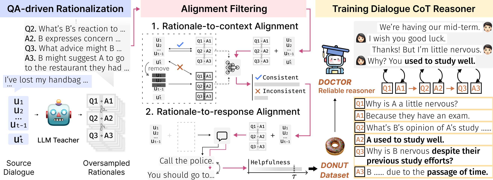

# Dialogue Chain-of-Thought Distillation for Commonsense-aware Conversational Agents
Official Repository of "Dialogue Chain-of-Thought Distillation for Commonsense-aware Conversational Agents" accepted at EMNLP 2023.

**Hyungjoo Chae\*, Yongho Song\*, Kai Tzu-iunn Ong, Taeyoon Kwon, Minjin Kim, Youngjae Yu, Dongha Lee, Dongyeop Kang, Jinyoung Yeo**<br><sup> * Equal contribution </sup>

Paper Link: https://arxiv.org/abs/2310.09343

Demonstration: https://dialoguecot.web.app/

Overview of dialogue chain-of-thought distillation processs.
<p align="center">
  
</p>

## Requirements
- We implemented DOCTOR using 8 NVIDIA A5000 GPUs (VRAM 24 GB). You may need gpu accelerator with at least 16GB VRAM.
- Make sure PyTorch (>= 1.8.0) installed. 
- As we use qlora for efficient training, `bitsandbytes` library is required.
- Prepare your OpenAI account (for API call, about 1500 USD is expected for the full annotation. Prepare your money!).
## STEP 1. Rationale annotation on existing dialogue datasets
- Get prepared the dialogue datsets using `src/rationale_annotation/prepare_dataset.py`
- Start rationale annotation by executing `sh src/rationale_annotation/run_distill.sh`. Note that you have to set the environment variable `OPENAI_API_KEY` as your openai api key.

## STEP 2. Alignment filtering
Apply filtering using our alignment filters. We provide the dataset which already has been filtered by us.
### Resulitng dataset (🍩 DONUT)
We share our dataset in the linke below.

[DLI-Lab/DONUT](https://huggingface.co/datasets/DLI-Lab/DONUT)
## STEP 3. Training 👨‍⚕️ DOCTOR
We train DOCTOR based on OPT 1.3B using qlora which supports 4-bit quantization with lora adapter.
### Checkpoint for DOCTOR
We share our checkpoint for DOCTOR in the link below.
Using the collected dataset, we train our knowledge model, DOCTOR, in a seq2seq manner.
```
sh src/train_knowledge_model/train_ours_final.sh
```
[DLI-Lab/DOCTOR](https://huggingface.co/DLI-Lab/DOCTOR)

## Evaluation 
Lastly, we evaluate DOCTOR as a commonsense reasoner that supports response generation. We use ChatGPT as a dialogue agent. Before generating responses, you have to prepare the predicted rationale files which will be concatenated with dialogue context and fed as an input for dialogue agent.
```
python src/run_response_generation.py
```
## Citation
If you find this useful, please consider citing our paper:
```
@misc{chae2023dialogue,
      title={Dialogue Chain-of-Thought Distillation for Commonsense-aware Conversational Agents}, 
      author={Hyungjoo Chae and Yongho Song and Kai Tzu-iunn Ong and Taeyoon Kwon and Minjin Kim and Youngjae Yu and Dongha Lee and Dongyeop Kang and Jinyoung Yeo},
      year={2023},
      eprint={2310.09343},
      archivePrefix={arXiv},
      primaryClass={cs.CL}
}
```  

