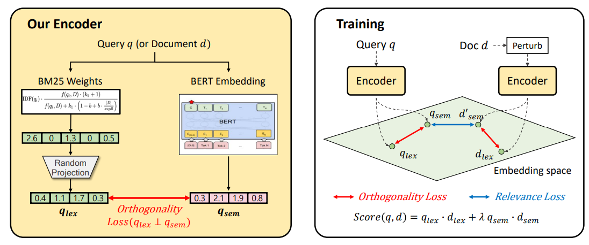

# On Complementarity Objectives for Hybrid Retrieval (ACL 2023)

## Overview

### Paper description and main idea:

Dense retrieval has shown promising results in various information retrieval tasks, and hybrid retrieval, combined with the strength of sparse retrieval, has also been actively studied. A key challenge in hybrid retrieval is to make sparse and dense complementary to each other. Existing models have focused on dense models to capture "residual" features neglected in the sparse models. Our key distinction is to show how this notion of residual complementarity is limited, and propose a new objective, denoted as RoC (Ratio of Complementarity), which captures a fuller notion of complementarity. We propose a two-level orthogonality designed to improve RoC, then show that the improved RoC of our model, in turn, improves the performance of hybrid retrieval. Our method outperforms all state-of-the-art methods on three representative IR benchmarks: MSMARCO-Passage, Natural Questions, and TREC Robust04, with statistical significance. Our finding is also consistent in various adversarial settings.



### Contribution:

* We study the problem of hybrid retrieval, where existing state-of-the-arts have pursued a partial notion of complementarity, and propose RoC, a metric that captures a fuller notion of the complementarity between sparse and dense models.
* We then propose a simple but effective two-level orthogonality objective to enhance RoC and verify that optimizing RoC enhances both complementarity and retrieval, leads to outperforming state-of-the-arts in three representative IR benchmarks, MSMARCO-Passage, Natural Questions, and TREC Robust04, and generalizing to adversarial settings.

## Code Running

### Before Running
We require to install DPR before running this code.

```bash
git clone git@github.com:facebookresearch/DPR.git
cd DPR
pip install .
```

### Data formats
We use same data format as DPR. Please visit https://github.com/facebookresearch/DPR for more details.

### Retriever training
```bash
python train_dense_encoder.py \
train_datasets=[list of train datasets, comma separated without spaces] \
dev_datasets=[list of dev datasets, comma separated without spaces] \
train=biencoder_local \
output_dir={path to checkpoints dir}
```

Example for NQ dataset
```bash
python train_dense_encoder.py \
train_datasets=[nq_train] \
dev_datasets=[nq_dev] \
train=biencoder_local \
output_dir={path to checkpoints dir}
```

### Retriever inference
```bash
python generate_dense_embeddings.py \
	model_file={path to biencoder checkpoint} \
	ctx_src={name of the passages resource, set to dpr_wiki to use our original wikipedia split} \
	shard_id={shard_num, 0-based} num_shards={total number of shards} \
	out_file={result files location + name PREFX}	
```

### Retriever validation against the entire set of documents:
```bash
python dense_retriever.py \
	model_file={path to a checkpoint downloaded from our download_data.py as 'checkpoint.retriever.single.nq.bert-base-encoder'} \
	qa_dataset={the name os the test source} \
	ctx_datatsets=[{list of passage sources's names, comma separated without spaces}] \
	encoded_ctx_files=[{list of encoded document files glob expression, comma separated without spaces}] \
	out_file={path to output json file with results} 
	
```

For example, If your generated embeddings fpr two passages set as ~/myproject/embeddings_passages1/wiki_passages_* and ~/myproject/embeddings_passages2/wiki_passages_* files and want to evaluate on NQ dataset:
```bash
python dense_retriever.py \
	model_file={path to a checkpoint file} \
	qa_dataset=nq_test \
	ctx_datatsets=[dpr_wiki] \
	encoded_ctx_files=[\"~/myproject/embeddings_passages1/wiki_passages_*\",\"~/myproject/embeddings_passages2/wiki_passages_*\"] \
	out_file={path to output json file with results} 
```

### Reader model training
```bash
python train_extractive_reader.py \
	encoder.sequence_length=350 \
	train_files={path to the retriever train set results file} \
	dev_files={path to the retriever dev set results file}  \
	output_dir={path to output dir}
```
### Reader model inference
```bash
python train_extractive_reader.py \
  prediction_results_file={path to a file to write the results to} \
  eval_top_docs=[10,20,40,50,80,100] \
  dev_files={path to the retriever results file to evaluate} \
  model_file= {path to the reader checkpoint} \
  train.dev_batch_size=80 \
  passages_per_question_predict=100 \
  encoder.sequence_length=350
```

#### Evaluate retrieval accuracy and generate top passage results for each of the train/dev/test datasets.
```bash
python dense_retriever.py \
	model_file={path to the best checkpoint or use our proivded checkpoints (Resource names like checkpoint.retriever.*)  } \
	qa_dataset=nq_test \
	ctx_datatsets=[dpr_wiki] \
	encoded_ctx_files=["{glob expression for generated embedding files}"] \
	out_file={path to the output file}
```

#### 5. Reader training
```bash
python train_extractive_reader.py \
	encoder.sequence_length=350 \
	train_files={path to the retriever train set results file} \
	dev_files={path to the retriever dev set results file}  \
	gold_passages_src={path to data.gold_passages_info.nq_train file} \
	gold_passages_src_dev={path to data.gold_passages_info.nq_dev file} \
	output_dir={path to output dir}
```

## Reference
If you find this code helpful, please consider citing:
```
@inproceedings{lee-etal-2023-complementarity,
    title = "On Complementarity Objectives for Hybrid Retrieval",
    author = "Lee, Dohyeon  and
      Hwang, Seung-won  and
      Lee, Kyungjae  and
      Choi, Seungtaek  and
      Park, Sunghyun",
    booktitle = "Proceedings of the 61st Annual Meeting of the Association for Computational Linguistics (Volume 1: Long Papers)",
    year = "2023",
    publisher = "Association for Computational Linguistics",
    url = "https://aclanthology.org/2023.acl-long.746",
    doi = "10.18653/v1/2023.acl-long.746",
}
```
