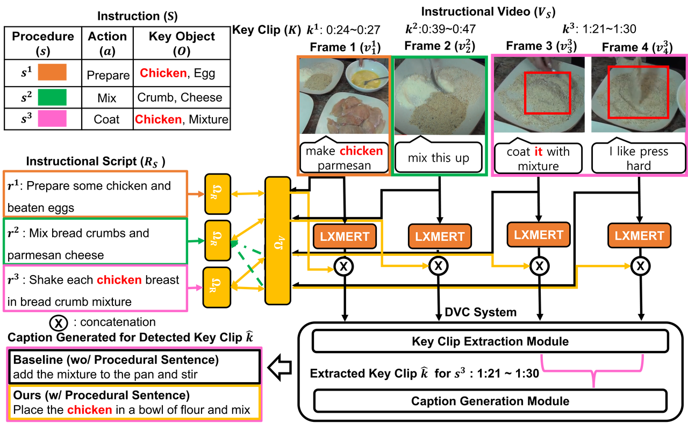

## Overview

### Paper description and main idea:

Instructional videos make learning knowledge more efficient, by providing a detailed multimodal context of each procedure in instruction. A unique challenge posed by instructional videos is key-object degeneracy, where any single modality fails to sufficiently capture the key objects referred to in the procedure. For machine systems, such degeneracy can disturb the performance of a downstream task such as dense video captioning, leading to the generation of incorrect captions omitting key objects. To repair degeneracy, we propose a retrieval-based framework to augment the model representations in the presence of such key-object degeneracy. We validate the effectiveness and generalizability of our proposed framework over baselines using modalities with key-object degeneracy.



### Contribution:

* We propose a temporal description retrieval task to find the procedural sentences procedurally aligned to each frame in instructional videos.
* We propose a key object-aware frame contrastive learning objective (KOFCL) to improve temporal description retrieval.
* We show the improved temporal description retrieval repairs degeneracy and improves DVC significantly.

## Code Running

This software includes code for temporal description retrieval and dense video captioning on youcook2.
As we use lxmert encoding for video frames, we first explain how to use lxmert for youcook2.
To use lxmert encodings, 
1. yc2 videos should be downloaded from youtube including transcript.
2. extract image features with faster rcnn to be fed to lxmert (we recommend to visit lxmert official github) 
3. clone official lxmert code and place official lxmert pretrained weight as official github says.

For temporal description retrieval, use `dual_encoder-lxmert_sequence_encoder_lstm-outsegs__framecontrast.ipynb` code.
For efficient training we dumped image features from faster rcnn tokenized result to be used for pytorch dataset code in above mentioned ipynb file.
Run each cells in `dual_encoder-lxmert_sequence_encoder_lstm-outsegs__framecontrast.ipynb`.

For dense video captioning, clone official github repo of EMT or PDVC under EMT_yc2 or PDVC_yc2.
first dump lxmert encoding similar to `dual_encoder-lxmert_sequence_encoder_lstm-outsegs__framecontrast.ipynb`.
To use EMT for dense video captioning, use densecap_ours_lxmert_seq_contrast.ipynb.
For PDVC, run
```
python train.py --cfg_path ${config_path} --gpu_id ${GPU_ID} --data_rescale 0
```
with
```
config_path=cfgs/yc2_tsn_pdvc_lxmert+contrast_recipe_768_no_base_encoder_5e-5.yml
```

## Reference
If you find this code helpful, please consider citing:
```
@inproceedings{jung-etal-2023-retrieval,
    title = "Retrieval-augmented Video Encoding for Instructional Captioning",
    author = "Jung, Yeonjoon  and
      Kim, Minsoo  and
      Choi, Seungtaek  and
      Kim, Jihyuk  and
      Seo, Minji  and
      Hwang, Seung-won",
    booktitle = "Findings of the Association for Computational Linguistics: ACL 2023",
    year = "2023",
    publisher = "Association for Computational Linguistics",
    url = "https://aclanthology.org/2023.findings-acl.543",
    doi = "10.18653/v1/2023.findings-acl.543",
}
```
