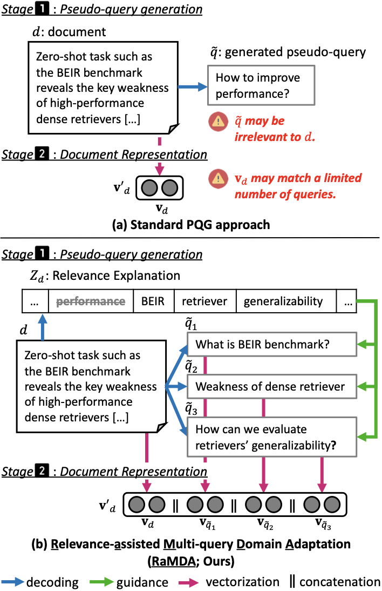

# Relevance-assisted Generation for Robust Zero-shot Retrieval (RaMDA)

Our implementation is adapted from [BEIR](https://github.com/beir-cellar/beir) and [SPLADE](https://github.com/naver/splade). Thanks to the contributors for releasing the code bases!
The following codes are for an example BEIR dataset (`dataset=nfcorpus`), assuming that the dataset is stored in `data/beir/$dataset`. For other datasets, replace `dataset` variable with a target dataset among names listed in **Dataset** in [BEIR repo](https://github.com/beir-cellar/beir#beers-available-datasets), e.g., via `export dataset=scidocs`.

## Overview

### Paper description and main idea:
Zero-shot retrieval tasks such as the BEIR benchmark reveal out-of-domain generalization as a key weakness of high-performance dense retrievers. As a solution, domain adaptation for dense retrievers has been actively studied. A notable approach is synthesizing domain-specific data, by generating pseudo queries (PQ), for fine-tuning with domain-specific relevance between PQ and documents. Our contribution is showing that key biases can cause sampled PQ to be irrelevant, negatively contributing to generalization. We propose to preempt their generation, by dividing the generation into simpler subtasks, of generating relevance explanations and guiding the generation to avoid negative generalization. Experiment results show that our proposed approach is more robust to domain shifts, validated on challenging BEIR zero-shot retrieval tasks.



### Contribution:

* We analyze existing PQG and identify their term frequency bias and diversity bias.
* We disentangle generation into relevance explanation and relevance-guided generation, for relevance-guided multi-query generation.
* We showed that our relevance-guided generation is robust to distribution shifts, complements the document, and thus improves document representation.

## Code Running

### Preliminary: segment documents in the corpus

```bash
export dataset=nfcorpus

# Download the dataset    
python -m utils.download_dataset --dataset $dataset --target_directory data/beir/

# Segment documents
python -m utils.segmentation \
--segment_size 128 --max_n_segments 4 \
--data_path data/beir/$dataset --output_dir data/beir/$dataset/segmented

# Flatten segmented documents
python -m utils.flatten_segmented_documents --data_path data/beir/$dataset/segmented
```

### Pseudo-query generation

```bash
# 1. Run SPLADE
experiments/run_splade.py/beir/$dataset/corpus.splade.jsonl
python -m tools.run_splade.run_splade --batch_size 48 \
--dataset $dataset \
--output_dir data/beir/$dataset/splade \
--corpus_path data/beir/$dataset/corpus.jsonl

# 1-1. Post-processing: Convert BERT tokens into T5 tokens, to be used in the next step
python -m tools.run_splace.convert_splade_to_t5_tokens \
--use_dictionary --use_document \
--corpus_path data/beir/$dataset/corpus.jsonl \
--splade_path data/beir/$dataset/splade/corpus.splade.jsonl \
--outfile_path data/beir/$dataset/splade/corpus.splade.t5.jsonl

# 2. Run RaMDA-Generator
python -m qgen.qgen \
--corpus_path data/beir/$dataset/segmented/corpus.flatten.jsonl \
--splade_path data/beir/$dataset/splade/corpus.splade.t5.jsonl \
--output_dir data/beir/$dataset/qgen/ \
--generator_name_or_path JihyukKim/RaMDA-G \
--ques_per_passage 50 --bsz 2

# 2-1. Post-processing: Convert RaMDA-Generator outputs into pseudo-queries
python -m utils.convert_gpl_to_jsonl \
--gpl_dataset_directory data/beir/$dataset/qgen/ \
--outfile_path data/beir/$dataset/qgen/corpus.pseudo_queries.jsonl
# -- remove unnecessary files
rm -v data/beir/$dataset/qgen/corpus.jsonl
rm -v data/beir/$dataset/qgen/qgen-queries.jsonl
rm -r -v data/beir/$dataset/qgen/qgen-qrels
```

### Run retrieval

**Step 1. Cache document embeddings**

```bash
python -m utils.cache_embeddings.cache_embeddings \
--model_name OpenMatch/cocodr-base-msmarco \
--output_dir data/beir/$dataset/cache_embeddings/ \
--corpus_path data/beir/$dataset/corpus.jsonl
```

**Step 2. Run and evaluate retriever**

```bash
python -m run_retrieval \
--pooling cls \
--q_model_path JihyukKim/RaMDA-R-$dataset --q_max_len 64 \
--use_body --body_score_function cos_sim --body_cached_embedding_path data/beir/$dataset/cache_embeddings/doc_embs.pt --body_weight 0.5 \
--use_pseudo_queries --pq_model_path JihyukKim/RaMDA-R-$dataset --pq_max_len 64 --pq_score_function cos_sim --pseudo_queries_weight 0.5 \
--pseudo_queries_path data/beir/$dataset/qgen/corpus.pseudo_queries.jsonl \
--output_dir data/beir/$dataset/result/ --save_ranking \
--data_path data/beir/$dataset --batch_size 256 
```

* performance results: `data/beir/$dataset/result/results.json`
* ranking results: `data/beir/$dataset/result/ranking.tsv`


## Reference

**This paper will be presented at EMNLP 2023 but is not published yet.**

Jihyuk Kim, Minsoo Kim, Joonsuk Park, and Seung-won Hwang. Relevance-assisted Generation for Robust Zero-shot Retrieval. EMNLP 2023 (industry track), to appear.
